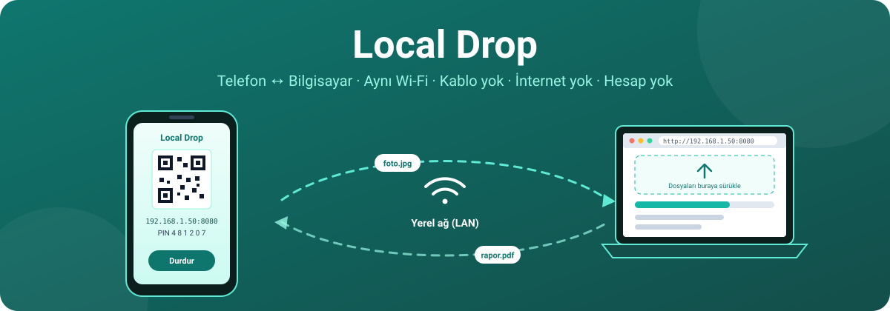
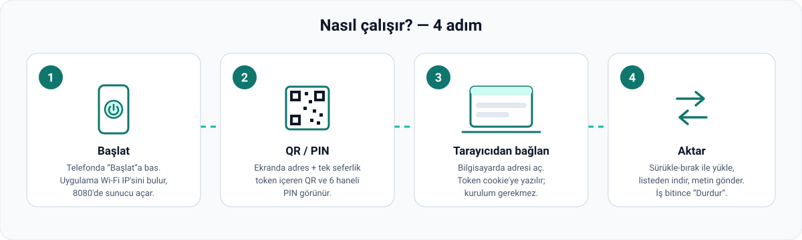
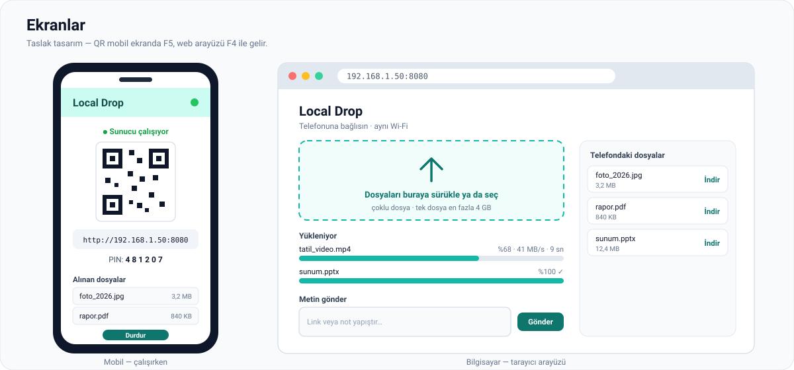
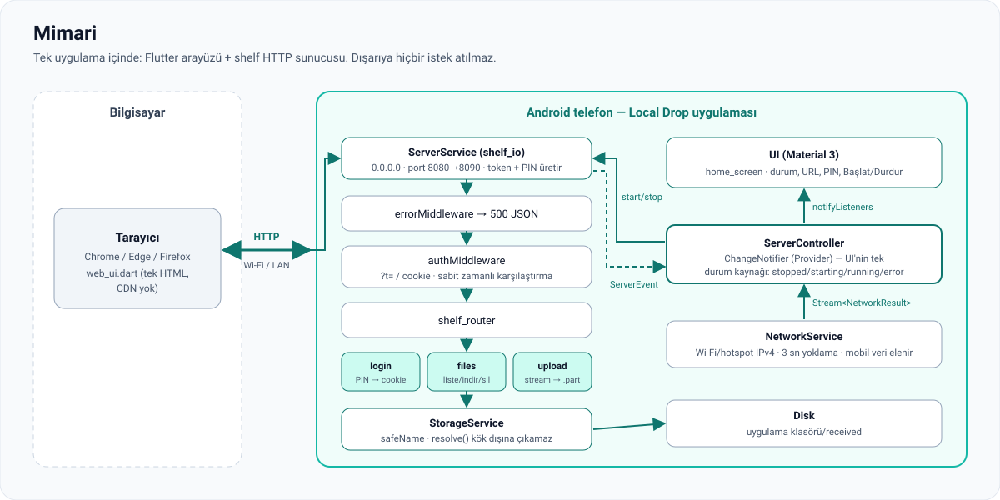
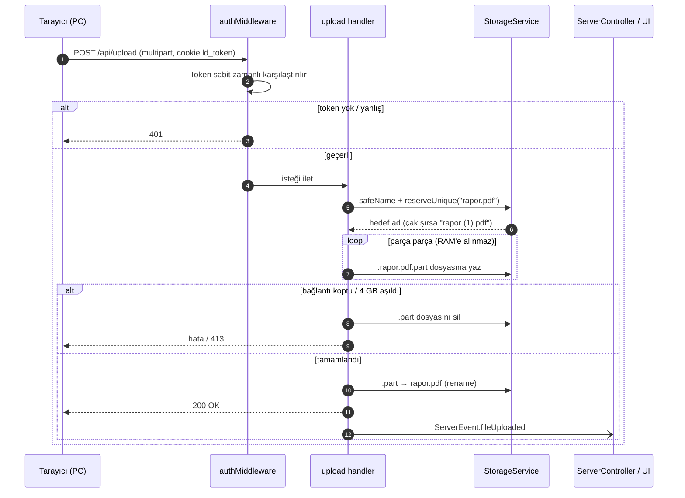

<p align="center">
  
</p>

<p align="center">
  
  
  
  
</p>

# Local Drop

**Local Drop**, Android telefonunu aynı Wi-Fi'deki bilgisayar için geçici bir dosya sunucusuna çevirir. Bilgisayarda hiçbir şey kurmazsın: tarayıcıdan telefondaki adrese girersin, dosyaları sürükleyip bırakırsın, telefondaki dosyaları indirirsin.

- 📵 **İnternet yok, bulut yok, hesap yok.** Veri yalnızca yerel ağda, iki cihaz arasında gider.
- 🔌 **Kablo yok, kurulum yok.** Bilgisayar tarafı sadece bir tarayıcı.
- 🔐 **Korumalı.** Her başlatmada yeni token üretilir; erişim QR'daki token ya da 6 haneli PIN ile.
- 📦 **Büyük dosyalar.** Yüklemeler RAM'e alınmadan doğrudan diske akar (tek dosya 4 GB'a kadar).

> **Neden?** Kendine WhatsApp'tan dosya göndermek, kablo aramak ya da bir dosya için buluta yükleyip indirmek yerine: *aç → okut → bırak.*

---

## Nasıl çalışır?

<p align="center">
  
</p>

1. **Başlat** — Telefonda *Başlat*'a basarsın. Uygulama Wi-Fi (veya hotspot) IPv4 adresini bulur, mobil veri arayüzlerini eler ve `8080` portunda bir HTTP sunucusu açar. Port doluysa `8081 … 8090` arasında ilk boş olanı kullanır.
2. **QR / PIN** — Ekranda `http://192.168.1.50:8080/?t=<token>` adresi, bu adresin QR kodu ve 6 haneli bir PIN görünür. Token ve PIN her başlatmada yeniden üretilir.
3. **Tarayıcıdan bağlan** — Bilgisayarda adresi açarsın (ya da `/login` sayfasında PIN'i girersin). Token, `HttpOnly` ve `SameSite=Strict` bir cookie'ye yazılır; sonraki isteklerde tekrar sorulmaz.
4. **Aktar** — Dosyaları sürükle-bırak ile telefona yükle, telefondaki dosyaları listeden indir, ya da bir link veya notu metin olarak gönder. İşin bitince *Durdur*: sunucu kapanır, token geçersiz olur.

---

## Ekranlar

<p align="center">
  
</p>

> Görseller **hedef tasarım** taslağıdır. Tarayıcı arayüzü F4, QR'lı mobil ekran F5 ile tamamlanacak. Gerçek ekran görüntüleri o fazlardan sonra eklenecek.

---

## Mimari

<p align="center">
  
</p>

Uygulama tek bir Flutter süreci içinde iki parçadan oluşur:

| Katman | Dosya | Görev |
|---|---|---|
| Arayüz | `lib/ui/` | Durum, adres, PIN, Başlat/Durdur. Yalnızca `ServerController`'ı dinler. |
| Durum | `lib/state/server_controller.dart` | `ChangeNotifier` (Provider). `stopped → starting → running → error` durumlarının tek kaynağı. |
| Ağ | `lib/services/network_service.dart` | Wi-Fi/hotspot IPv4 tespiti, 3 sn'de bir yoklama, yalnızca değişimde yayın. |
| Sunucu | `lib/services/server_service.dart` | `shelf_io` ile `0.0.0.0` üzerinde dinler, token/PIN üretir, `ServerEvent` akışı yayınlar. |
| İstek hattı | `lib/server/` | `errorMiddleware → authMiddleware → shelf_router → handler` |
| Depolama | `lib/services/storage_service.dart` | Dosya adlarını temizler; tüm yollar `resolve()` üzerinden, kök klasör dışına çıkamaz. |

### Bir dosya yüklemesi adım adım



---

## Güvenlik

| Risk | Önlem |
|---|---|
| Aynı ağdaki başka biri erişirse | Her başlatmada 16 karakterlik rastgele token (`Random.secure`). Token'sız her istek `401`. |
| Token tahmini | Sabit zamanlı karşılaştırma. Yanlış token için IP başına dakikada 10 deneme sınırı (F7). |
| Path traversal (`../../`) | `safeName()` ayırıcıları ve `..`'yı temizler; `StorageService.resolve()` kök dışındaki yolu reddeder. |
| Yarım kalan yükleme | Veri önce `.part` dosyasına yazılır. Bağlantı koparsa silinir; tamamlanınca yeniden adlandırılır. |
| Bellek taşması | Yükleme ve indirme akış (stream) ile yapılır; dosya belleğe alınmaz. |
| XSS (F4) | Web arayüzünde kullanıcı verisi yalnızca `textContent` ile basılır; harici CDN yok; CSP başlığı. |
| Dışarıya veri sızması | Uygulama hiçbir dış sunucuya istek atmaz; analytics ve telemetri yok. |

> ⚠️ Sunucu şifresiz HTTP kullanır. Yalnızca güvendiğin ağlarda (ev, kişisel hotspot) kullan. Misafir ağlarda "client isolation" nedeniyle bağlantı zaten kurulamayabilir.

---

## HTTP API

Tüm uçlar token ister (`?t=<token>` veya `ld_token` cookie'si). `/login` hariç.

| Yöntem | Yol | Açıklama |
|---|---|---|
| `GET` | `/` | Web arayüzü (token yoksa `/login`'e yönlendirir) |
| `GET` / `POST` | `/login` | PIN ile giriş, cookie ayarlar |
| `GET` | `/api/files` | Telefondaki dosyalar: `[{name, size, modified}]` |
| `POST` | `/api/upload` | `multipart/form-data` yükleme |
| `GET` | `/api/download/<ad>` | Dosyayı indir (`Content-Disposition: attachment`) |
| `DELETE` | `/api/files/<ad>` | Dosyayı sil |
| `POST` | `/api/text` | Telefona metin gönder (F4) |

Tarayıcı olmadan, PowerShell ile denemek için:

```powershell
$U = "http://192.168.1.50:8080"; $T = "<ekrandaki-token>"
curl.exe -s "$U/api/files?t=$T"
curl.exe -s -F "file=@C:\temp\test.zip" "$U/api/upload?t=$T"
curl.exe -s -o C:\temp\geri.zip "$U/api/download/test.zip?t=$T"
```

---

## Çalıştırma

**Gereksinimler:** Flutter (Dart SDK ≥ 3.13), Android cihaz (minSdk Flutter varsayılanı), telefon ve bilgisayar aynı Wi-Fi'de.

```powershell
git clone https://github.com/ismailsoylemez-dev/local_drop.git
cd local_drop
flutter pub get
flutter run            # USB ile bağlı Android cihazda
```

> Emülatör kendi sanal ağını kullandığı için (`10.0.2.x`) bilgisayardan erişilemez. Gerçek cihazda test et.

**Testler**

```powershell
flutter analyze
flutter test           # birim + handler + yerel entegrasyon (gerçek sunucu 127.0.0.1'de)
```

Entegrasyon testleri 50 MB akış yüklemesini sha256 ile doğrular, kopan bağlantıda `.part` kalmadığını, 5 eşzamanlı yüklemeyi ve dolu port durumunu kontrol eder.

---

## Yol haritası

| Faz | İçerik | Durum |
|---|---|---|
| F0 | Repo ve ajan dokümanları | ✅ |
| F1 | Flutter iskeleti, Provider | ✅ |
| F2 | Wi-Fi / hotspot IP tespiti | ✅ |
| F3 | HTTP sunucu, token/PIN, yükleme/indirme/silme | ✅ |
| F4 | Tarayıcı arayüzü (sürükle-bırak, ilerleme, metin) | ⏳ |
| F5 | Mobil arayüz (QR, dosya listesi, telefondan gönderme) | ⏳ |
| F6 | Arka planda çalışma (foreground service), İndirilenler klasörü | ⏳ |
| F7 | Rate limit, disk dolu, ağ değişiminde yeniden başlatma | ⏳ |
| F8 | İkon, onboarding, ayarlar, yayın hazırlığı | ⏳ |

---

## Proje yapısı

```text
lib/
├── main.dart, app.dart
├── core/       sabitler, log, hata tipleri, safe_name, secrets (token/PIN), lan_ip
├── services/   network_service, server_service, storage_service
├── server/     router, auth_middleware, handlers/ (login, files, upload)
├── state/      server_controller
└── ui/         screens/
test/
├── unit/        saf fonksiyonlar
├── server/      handler testleri (ağ açmadan)
└── integration/ gerçek sunucu ile uçtan uca
docs/
├── PROJE_OZET.md   güncel durum (tek giriş noktası)
├── FAZLAR.md       faz görevleri ve test senaryoları
├── AJAN_IS.md      geliştirme ajanı kuralları
└── images/         README görselleri
```

## Geliştirme

Proje, faz faz bir yapay zekâ kodlama ajanıyla geliştiriliyor. Kurallar ve süreç:

- [`docs/AJAN_IS.md`](docs/AJAN_IS.md) — her işte geçerli kod, test, git ve token kuralları
- [`docs/FAZLAR.md`](docs/FAZLAR.md) — fazların kapsamı ve T1–T5 test senaryoları
- [`docs/PROJE_OZET.md`](docs/PROJE_OZET.md) — mimari, kararlar, açık bulgular, cihaz testleri
